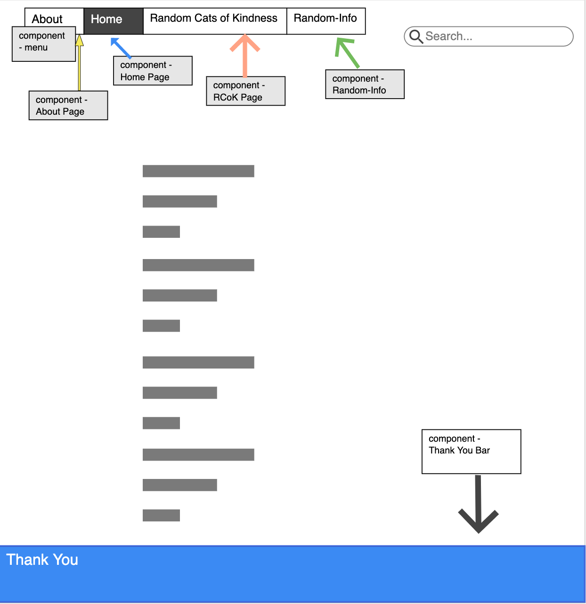
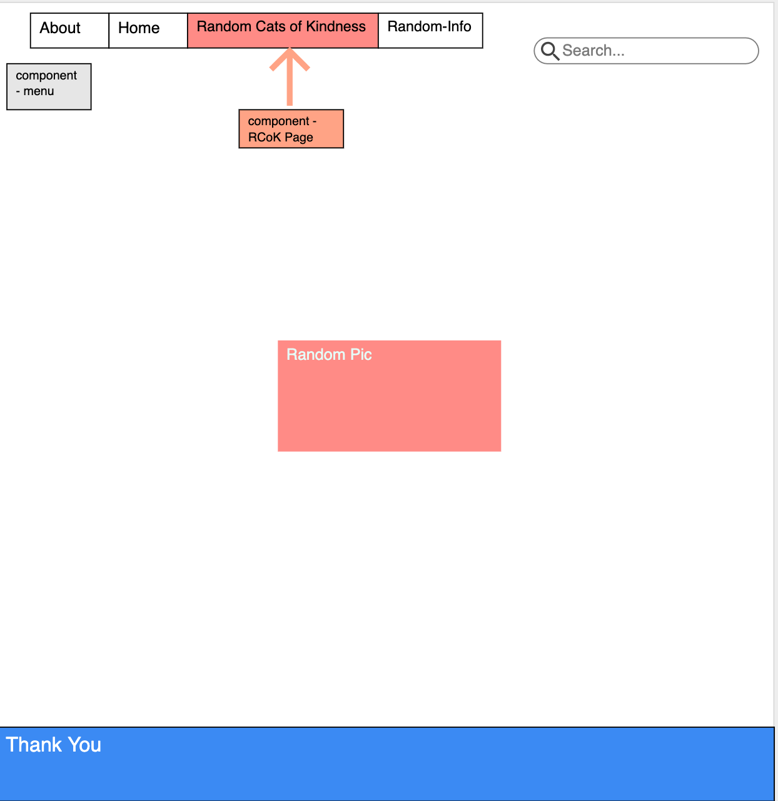
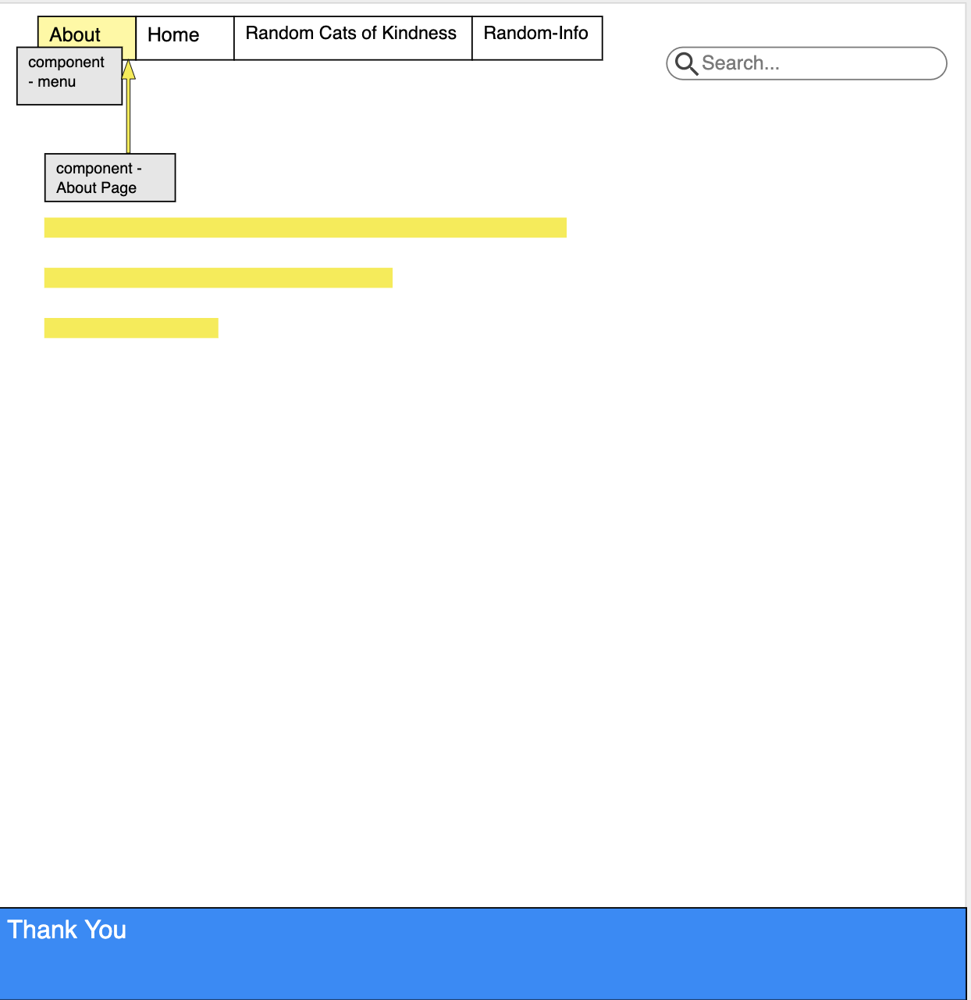
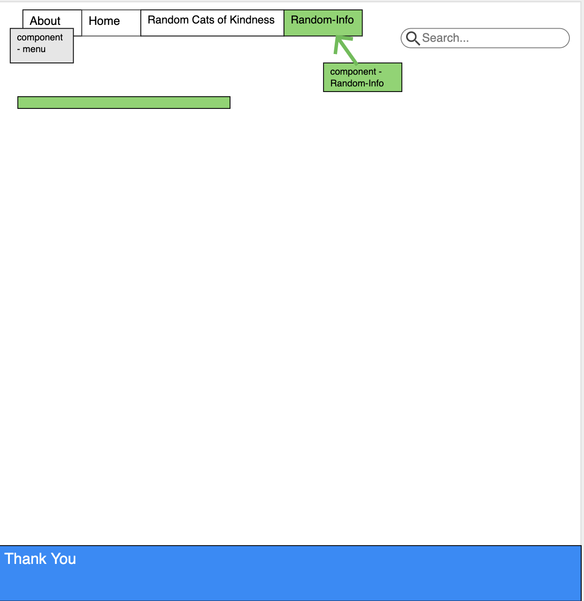

For the record I'm a dog person.

Wireframes are located on the first page of this repository

API Link - https://thecatapi.com/v1/images?api_key=aaa32b32-301f-40ad-8c62-a9054e33d188 

To run install:                                                                     
npm i react-router-dom                                                           
npm i axios                                                         

Stateless components-                         
1. Top Menu
2. Home Page (selection page)
3. Thank You Page
4. Thank You Bar (it's a bar at the bottom of the page)
5. About Page              

Stateful components -               
1. Random Image Generator Page        
2. Search Bar / Search Page

Purpose -                                                                               
Create a search website for cat lovers or just peole who want to look at cats

Problem Statement                                                                       
 (Cats are easily found on the internet, from random pictures, to memes, and IG pages dedicated to specific cat, but rarely is it informative. I present a web application that makes searching for cats easy and enjoyable, also provides in depth description of the cat's origin and where they are most likely to be found (so it can be potentially easier to buy one from wherever))

Technical Problem Solution                                                                          
 (It will use an API to provide in depth description of the cat's origin and where they are most likely to be found (so it can be potentially easier to buy one from wherever). 
 A user may be able to click on a cat's name/species and navigate to the the image of that cat or they can search for a cat and get an image, or use an arrow button to click to a random image )

Technical Language                                                                                  
( The code will use async, await, fetch or axios.get to retrieve data from the API key. It will use many components to navigate through the navigation bar, the main page and other places. It will use onCllick / onSubmit functionc as well as the binding of the .this keyboard to refernece functions throughout the code in order so to have them render through the page(s).  )

CSS:
Every page has virtually the same styling as the home page
 

                        REFERENCE
a. minute mark - mm()

1. https://www.youtube.com/watch?v=Law7wfdg_ls&t=585s 

Rendering API console mm(maybe 17:00)
Could only use his ideas / paths and not his actual code

Ex.     
    //useEffect func came with vscode or some sort of extension
    //({}) in useEffect <- means it only runs when the components mount
    // calls the fetchCat function
    // fetchCAts calls the api, concatonates breeds on to it, and cl's the data to test
    // a variable called catnames to name the things that appear in the console

    function SearchPg ({ match }){
     useEffect(() => {
             getAxiosImage();
             console.log( match )
     }, [])

     // this seems to be another version of state / this.state 
     const [ data, catImages ] = useState({});

    // const baseLink = 'https://thecatapi.com/v1/images?api_key='
    // const catKEY = '4c63a8cd-ecf5-453c-b3c0-55c64aefd09e'
    // const breeds is to append on the baselink

    const getAxiosImage = async () => {
        // const images = 'images/search';
        const images = await axios.get(`https://api.thecatapi.com/v1/breeds`)
        // await axios.get(`https:thecatapi.com/v1/images/search?api_key=${match}`)
    }

2. API help
https://github.com/AdenForshaw/theCatApi-examples/blob/master/react/breed-selection/App.js

