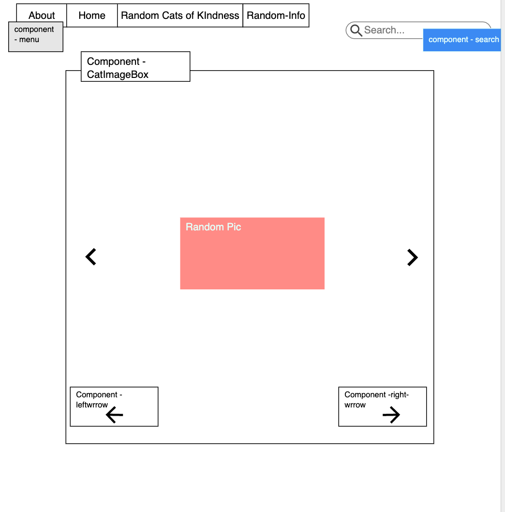

For the record I'm a dog person.

Wireframe is located on the first page of this repository

API Link - https://thecatapi.com/v1/images?api_key=aaa32b32-301f-40ad-8c62-a9054e33d188 

To run install:                                                                     
npm i react-router-dom                                                           
npm i axios                                                         

Purpose -                                                                               
Create a search website for cat lovers or just peole who want to look at cats

Problem Statement                                                                       
 (Cats are easily found on the internet, from random pictures, to memes, and IG pages dedicated to specific cat, but rarely is it informative. I present a web application that makes searching for cats easy and enjoyable, also provides in depth description of the cat's origin and where they are most likely to be found (so it can be potentially easier to buy one from wherever))

Technical Problem Solution                                                                          
 (It will use an API to provide in depth description of the cat's origin and where they are most likely to be found (so it can be potentially easier to buy one from wherever). 
 A user may be able to click on a cat's name/species and navigate to the the image of that cat or they can search for a cat and get an image, or use an arrow button to click to a random image )

Technical Language                                                                                  
( The code will use async, await, fetch or axios.get to retrieve data from the API key. It will use many components to navigate through the navigation bar, the main page and other places. It will use onCllick / onSubmit functionc as well as the binding of the .this keyboard to refernece functions throughout the code in order so to have them render through the page(s).  )

 